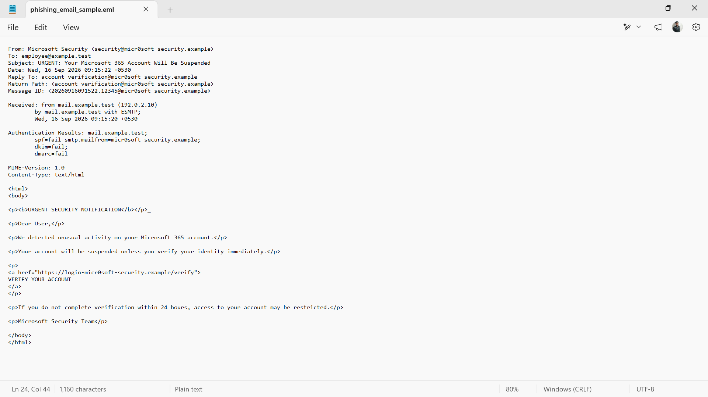

# 📧 Phishing Email Investigation & Threat Intelligence

A hands-on SOC Analyst project focused on phishing email investigation, email header analysis, IOC extraction, threat intelligence workflow, phishing risk assessment, MITRE ATT&CK mapping, and SOC response recommendations.

The project demonstrates the following investigation workflow:

**Phishing Email → Header Analysis → IOC Extraction → Threat Intelligence → Risk Assessment → MITRE ATT&CK → Analyst Assessment → SOC Response**

---

## 📌 Project Overview

This project simulates a phishing email investigation in a controlled cybersecurity laboratory environment.

A synthetic phishing email was created containing multiple indicators commonly associated with phishing activity.

The email was analyzed from a SOC Analyst perspective to identify suspicious characteristics, extract indicators, assess authentication results, perform threat-intelligence enrichment, map the observed behavior to MITRE ATT&CK, and document the investigation.

The project was intentionally designed using synthetic test data. No real person, organization, production system, or real attacker infrastructure was targeted.

---

# 🎯 Objectives

- Analyze a phishing email
- Investigate email headers
- Analyze sender information
- Analyze Reply-To and Return-Path fields
- Review SPF, DKIM, and DMARC results
- Identify suspicious email characteristics
- Extract Indicators of Compromise (IOCs)
- Analyze URLs, domains, and IP addresses
- Apply a threat-intelligence workflow
- Assess phishing risk
- Map the observed behavior to MITRE ATT&CK
- Determine whether evidence of compromise exists
- Document recommended SOC response actions
- Produce professional investigation documentation

---

# 🛠️ Technologies & Tools

| Technology / Tool | Purpose |
|---|---|
| **Windows 11** | Investigation environment |
| **Email Header Analysis** | Sender, routing, and authentication analysis |
| **VirusTotal** | Threat-intelligence enrichment workflow |
| **AbuseIPDB** | IP reputation analysis workflow |
| **MITRE ATT&CK** | Adversary behavior mapping |
| **Notepad** | Synthetic `.eml` sample creation and analysis |

---

# 📧 Synthetic Phishing Email

A synthetic phishing email was created specifically for this controlled laboratory exercise.

### Subject

```text
URGENT: Your Microsoft 365 Account Will Be Suspended
```

### Sender

```text
Microsoft Security <security@micr0soft-security.example>
```

### Reply-To

```text
account-verification@micr0soft-security.example
```

### Return-Path

```text
account-verification@micr0soft-security.example
```

### Verification URL

```text
https://login-micr0soft-security.example/verify
```

### Source IP

```text
192.0.2.10
```

---

# 🔎 Email Header Analysis

The email header was analyzed to identify sender identity, routing information, reply handling, and email authentication results.

## Header Findings

| Header / Indicator | Observed Value |
|---|---|
| **From** | security@micr0soft-security.example |
| **To** | employee@example.test |
| **Subject** | URGENT: Your Microsoft 365 Account Will Be Suspended |
| **Reply-To** | account-verification@micr0soft-security.example |
| **Return-Path** | account-verification@micr0soft-security.example |
| **Received** | mail.example.test (192.0.2.10) |
| **SPF** | FAIL |
| **DKIM** | FAIL |
| **DMARC** | FAIL |

---

# 🚩 Phishing Indicators Identified

The investigation identified multiple suspicious characteristics in the synthetic email.

## 1. Brand Impersonation

The sender domain contains:

```text
micr0soft
```

The number `0` is used instead of the letter `o`.

This creates a brand-impersonation / typosquatting-style indicator.

---

## 2. Sender and Reply-To Analysis

The visible sender is:

```text
security@micr0soft-security.example
```

The Reply-To address is:

```text
account-verification@micr0soft-security.example
```

The sender and Reply-To context was treated as a suspicious indicator requiring investigation.

---

## 3. SPF Failure

The synthetic authentication result shows:

```text
SPF = FAIL
```

SPF is an email authentication mechanism used to help verify whether a sending server is authorized for a domain.

---

## 4. DKIM Failure

The synthetic authentication result shows:

```text
DKIM = FAIL
```

This was treated as an additional suspicious authentication indicator.

---

## 5. DMARC Failure

The synthetic authentication result shows:

```text
DMARC = FAIL
```

The combination of SPF, DKIM, and DMARC failures increases the suspicion associated with the sample.

---

## 6. Urgent Account-Suspension Language

The email claims that the user's Microsoft 365 account will be suspended unless verification is completed.

The message also introduces a 24-hour deadline.

This urgency was treated as a phishing indicator.

---

## 7. Suspicious Verification URL

The email contains the following URL:

```text
https://login-micr0soft-security.example/verify
```

The URL uses the suspicious-looking `micr0soft` domain and presents an account-verification action.

---

# 📸 Email Header Evidence



The screenshot shows the synthetic phishing email, sender information, routing fields, authentication results, source IP, and verification URL used during the investigation.

---

# 🔍 IOC Extraction

The following indicators were extracted from the email:

| IOC Type | Indicator |
|---|---|
| **Sender Email** | `security@micr0soft-security.example` |
| **Reply-To** | `account-verification@micr0soft-security.example` |
| **Domain** | `micr0soft-security.example` |
| **URL** | `https://login-micr0soft-security.example/verify` |
| **Source IP** | `192.0.2.10` |

---

# 🛡️ Threat Intelligence Workflow

The extracted indicators were treated as investigation targets for threat-intelligence enrichment.

## Domain

```text
micr0soft-security.example
```

## URL

```text
https://login-micr0soft-security.example/verify
```

## IP Address

```text
192.0.2.10
```

The indicators intentionally use synthetic laboratory values.

The `.example` domain and documentation IP address are not treated as evidence of real malicious infrastructure.

Therefore, this project does **not** claim a real-world malicious reputation for these indicators.

The purpose of this step was to demonstrate the SOC workflow:

```text
IOC Extraction
      ↓
Threat Intelligence Enrichment
      ↓
Context Analysis
      ↓
Analyst Assessment
```

---

# ⚠️ Phishing Risk Assessment

| Indicator | Assessment |
|---|---|
| Brand impersonation | Suspicious |
| Sender domain | Suspicious |
| Sender / Reply-To context | Suspicious |
| SPF | FAIL |
| DKIM | FAIL |
| DMARC | FAIL |
| Urgent account-suspension language | Suspicious |
| Account verification request | Suspicious |
| Verification URL | Suspicious-looking |

---

# 🧑‍💻 Analyst Assessment

## Final Classification

**PHISHING EMAIL — HIGH SUSPICION**

The email contains multiple phishing indicators, including:

- Brand impersonation
- Suspicious sender domain
- Sender / Reply-To concerns
- Failed SPF authentication
- Failed DKIM authentication
- Failed DMARC authentication
- Urgent account-suspension language
- Suspicious account-verification URL

The overall characteristics are consistent with a phishing email scenario.

However, this sample is synthetic and was created specifically for controlled SOC training and investigation practice.

---

# 🚫 Compromise Assessment

No evidence was collected showing that:

- The URL was clicked
- Credentials were submitted
- Malware was executed
- An endpoint was compromised
- An account was successfully compromised

Therefore:

```text
NO CONFIRMED COMPROMISE IDENTIFIED
```

The investigation remains limited to the evidence available from the synthetic email sample.

---

# 🎯 MITRE ATT&CK Mapping

## Tactic

**Initial Access**

## Technique

**T1566 – Phishing**

## Sub-technique

**T1566.002 – Phishing: Spearphishing Link**

### Mapping Rationale

The synthetic email contains a link presented as an account-verification action.

The phishing scenario is therefore mapped to:

```text
T1566.002 – Phishing: Spearphishing Link
```

### User Execution

`T1204.001 – User Execution: Malicious Link` was not asserted because there is no evidence in this laboratory exercise that the recipient clicked the link.

---

# 🛡️ Recommended SOC Response

If similar activity were detected in a production environment, a SOC Analyst could:

1. Quarantine or flag the email according to the organization's email-security procedures.
2. Review the sender, Reply-To, domain, URL, and authentication results.
3. Search the environment for other emails containing the same indicators.
4. Identify other recipients who received the message.
5. Determine whether any recipient interacted with the URL.
6. Check whether credentials were submitted.
7. If user interaction occurred, investigate the affected endpoint and account.
8. Block confirmed malicious indicators according to organizational procedures.
9. Monitor affected accounts and endpoints for follow-on activity.
10. Document and escalate the incident according to the organization's incident-response process.

---

# 🔄 SOC Investigation Workflow

```text
Phishing Email
      ↓
Email Header Analysis
      ↓
Sender / Reply-To Analysis
      ↓
SPF / DKIM / DMARC Analysis
      ↓
IOC Extraction
      ↓
URL / Domain / IP Analysis
      ↓
Threat Intelligence
      ↓
Risk Assessment
      ↓
MITRE ATT&CK Mapping
      ↓
Analyst Assessment
      ↓
SOC Response
      ↓
Incident Documentation
```

---

# 📁 Project Files

```text
phishing_email_sample.eml
01-phishing-email-header.png
Dhiraj_Antre_Phishing_Email_Investigation_Report.pdf
README.md
```

---

# 📸 Evidence

### Email Header Investigation


This evidence captures the main investigation data used in the project, including:

- Sender
- Recipient
- Subject
- Reply-To
- Return-Path
- Received header
- Source IP
- SPF result
- DKIM result
- DMARC result
- Suspicious verification URL

---

# 📄 Documentation Report

A detailed project documentation report is included in the repository.

**Report:**

`Dhiraj_Antre_Phishing_Email_Investigation_Report.pdf`

The report documents:

- Executive Summary
- Project Objective
- Synthetic Email Sample
- Email Header Analysis
- IOC Extraction
- Threat Intelligence Assessment
- Phishing Risk Assessment
- MITRE ATT&CK Mapping
- Analyst Assessment
- Recommended SOC Response
- SOC Workflow
- Skills Demonstrated
- Project Status
- Conclusion

---

# 📚 Skills Demonstrated

## Email Security

- Phishing Email Analysis
- Email Header Analysis
- Sender Analysis
- Reply-To Analysis
- Return-Path Analysis
- SPF Analysis
- DKIM Analysis
- DMARC Analysis

## Threat Intelligence

- IOC Extraction
- URL Analysis
- Domain Analysis
- IP Analysis
- Threat Intelligence Workflow
- Indicator Enrichment

## SOC Operations

- Phishing Triage
- Security Investigation
- Risk Assessment
- Incident Documentation
- SOC Response Recommendations

## Security Framework

- MITRE ATT&CK
- T1566 – Phishing
- T1566.002 – Spearphishing Link

---

# 💡 Key Learning Outcomes

Through this project, I practiced:

- Investigating phishing email headers
- Identifying suspicious sender characteristics
- Understanding Reply-To and Return-Path fields
- Analyzing SPF, DKIM, and DMARC results
- Extracting email-based IOCs
- Investigating URLs, domains, and IP addresses
- Applying a threat-intelligence workflow
- Assessing phishing risk
- Mapping phishing activity to MITRE ATT&CK
- Distinguishing suspicious activity from confirmed compromise
- Documenting SOC investigation findings
- Developing a structured incident-response workflow

---

# ⚠️ Lab Disclaimer

This project uses synthetic phishing-email data for cybersecurity learning and SOC investigation practice.

The `.example` domain and documentation IP address are used as non-production test indicators.

No real person, organization, production system, or real attacker infrastructure was targeted.

No real credentials were collected or submitted.

No real phishing campaign was conducted.

---

# 🚀 Project Status

**Completed ✅**

## Completed Components

- [x] Synthetic Phishing Email Creation
- [x] Email Header Analysis
- [x] Sender Analysis
- [x] Reply-To Analysis
- [x] Return-Path Analysis
- [x] SPF Analysis
- [x] DKIM Analysis
- [x] DMARC Analysis
- [x] Phishing Indicator Identification
- [x] IOC Extraction
- [x] URL Analysis
- [x] Domain Analysis
- [x] IP Analysis
- [x] Threat Intelligence Workflow
- [x] Phishing Risk Assessment
- [x] MITRE ATT&CK Mapping
- [x] Analyst Assessment
- [x] SOC Response Recommendations
- [x] Evidence Screenshot
- [x] Documentation Report

---

# 👨‍💻 Project Summary

This project demonstrates a practical phishing email investigation workflow from initial email analysis through IOC extraction, threat-intelligence assessment, phishing risk classification, MITRE ATT&CK mapping, analyst assessment, and recommended SOC response.

The investigation was performed using synthetic laboratory data and focuses on demonstrating practical entry-level SOC Analyst skills in:

**Email Security → Threat Intelligence → Phishing Investigation → MITRE ATT&CK → Incident Response**
